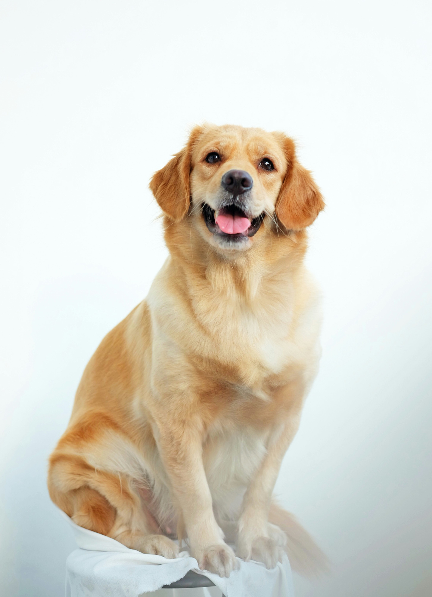

# Adversarial Perturbations

This repository demonstrates and visualizes adversarial attacks against image classification models. The project implements several popular attack methods and provides detailed visualizations of the perturbations and their effects.

## Overview

Adversarial inputs are image inputs to machine learning models (in this case an image clasasifier) designed to cause the model to make a mistake. This project focuses on generating adversarial perturbations for images that, when added to an original image, cause a deep learning classifier to misclassify the image.

Here are the results, highlighted:
| Attack | Success | L2 Distance | Time (s) | Original | Adversarial |
|--------|---------|-------------|----------|----------|-------------|
| DeepFool | Yes | 0.141822 | 17.90 | golden retriever | Labrador retriever |
| Carlini & Wagner L2 | Yes | 2.156872 | 0.99 | golden retriever | digital clock |
| PGD L2 | Yes | 1.999080 | 0.24 | golden retriever | digital clock |

## Attack Methods

The project implements and compares three state-of-the-art adversarial attack methods:

### 1. Carlini & Wagner L2 (C&W L2)

The C&W attack approaches adversarial example generation as an optimization problem. Instead of directly manipulating the image, it works in a transformed space that guarantees valid pixel values. The attack minimizes a carefully crafted objective function that balances two goals:
- Making minimal changes to the image (measured by L2 distance)
- Forcing the model to output the target class

The C&W attack uses binary search to find the optimal balance between perturbation size and misclassification strength.

### 2. Projected Gradient Descent L2 (PGD L2)

PGD takes an iterative approach. Instead of complex optimization, it repeatedly:
- Takes steps in the direction that increases the model's loss
- Projects the perturbation back onto an L2 ball to maintain a constraint on its size

The constraint ensures that the adversarial perturbation remains imperceptible to humans by keeping the L2 norm (Euclidean distance) of the perturbation below a threshold.

### 3. DeepFool

DeepFool takes a geometric perspective, iteratively finding the nearest decision boundary and stepping over it. It's an untargeted attack, meaning it simply tries to cause any misclassification rather than aiming for a specific target class.

DeepFool approximates decision boundaries locally as hyperplanes and then finds the shortest path to cross the nearest boundary, which represents the minimal perturbation needed to change the classification.

## Requirements

The project requires Python 3.8+ and the following packages:
- PyTorch (2.0.1+)
- torchvision
- torchattacks
- matplotlib
- numpy
- Pillow

You can install all dependencies with:

```bash
python3 -m venv venv
# On Linux: 
# source venv/bin/activate
# On Windows:
# venv\Scripts\activate
pip install -r requirements.txt
```

## Usage

To run the adversarial attack demonstration:

```bash
python3 adversarial_inputs.py
```

The script will:
1. Load a pre-trained ResNet50 image classifier
2. Load and preprocess the specified image
3. Perform multiple adversarial attacks on the image
4. Generate comprehensive visualizations
5. Compare the effectiveness of different attack methods

## Visualization Outputs

The script generates the following visualizations in the `results_real_image` directory:

- `original.png`: The original input image
- `adversarial_*.png`: The adversarial examples for each attack method
- `detailed_*.png`: Detailed comparisons showing original, adversarial, and perturbation for each attack
- `comprehensive_comparison.png`: A comprehensive visualization of all attacks
- `perturbation_comparison.png`: Bar chart comparing perturbation magnitudes (L2 distances)
- `computation_time_comparison.png`: Bar chart comparing computation times

## How It Works

### Measuring Perturbation

The magnitude of perturbations is measured using L2 Distance – the Euclidean distance between the original and perturbed images:

```python
# Calculate L2 distance
l2_distance = torch.norm(adversarial_image - image, p=2).item()
```

As a rule of thumb, for images with RGB values normalized to [0, 1], an L2 distance of < 5.0 is generally imperceptible to humans, while distances > 10.0 might be noticeable.

### Comparison of Attack Methods

In practice, these attacks have different characteristics:

- **C&W (Carlini & Wagner)** offers a good balance of speed and perturbation size
- **PGD (Projected Gradient Descent)** often achieves low L2 distances and runs faster than C&W in some cases
- **DeepFool** typically produces the smallest perturbations (lowest L2 distance) but may take longer to compute and is limited to untargeted attacks

## Code Structure

The main entry point is `adversarial_inputs.py`, which contains the following key functions:

- `plot_comprehensive_comparison()`: Creates a comprehensive visualization
- `plot_perturbation_magnitudes()`: Creates a bar chart for L2 distances
- `plot_computation_times()`: Creates a bar chart for computation times
- `plot_detailed_image_comparison()`: Creates a detailed visualization for a single attack
- `main()`: Orchestrates the entire process

## Image Attribution

The sample image used in this project is from Nita Anggraeni Goenawan on Unsplash.




Photo by <a href="https://unsplash.com/@nitanggraeni?utm_content=creditCopyText&utm_medium=referral&utm_source=unsplash">Nita Anggraeni Goenawan</a> on <a href="https://unsplash.com/photos/golden-retriever-puppy-on-white-background-2JihaEVs8Dc?utm_content=creditCopyText&utm_medium=referral&utm_source=unsplash">Unsplash</a>

## License

This project is open-source and available for educational purposes.

## Related Arxiv References

- [Fast Gradient Sign Method (FGSM)](https://arxiv.org/abs/1412.6572)
- [DeepFool](https://arxiv.org/abs/1511.04599)
- [Carlini & Wagner Attacks](https://arxiv.org/abs/1608.04644)
- [Projected Gradient Descent](https://arxiv.org/abs/1706.06083)
